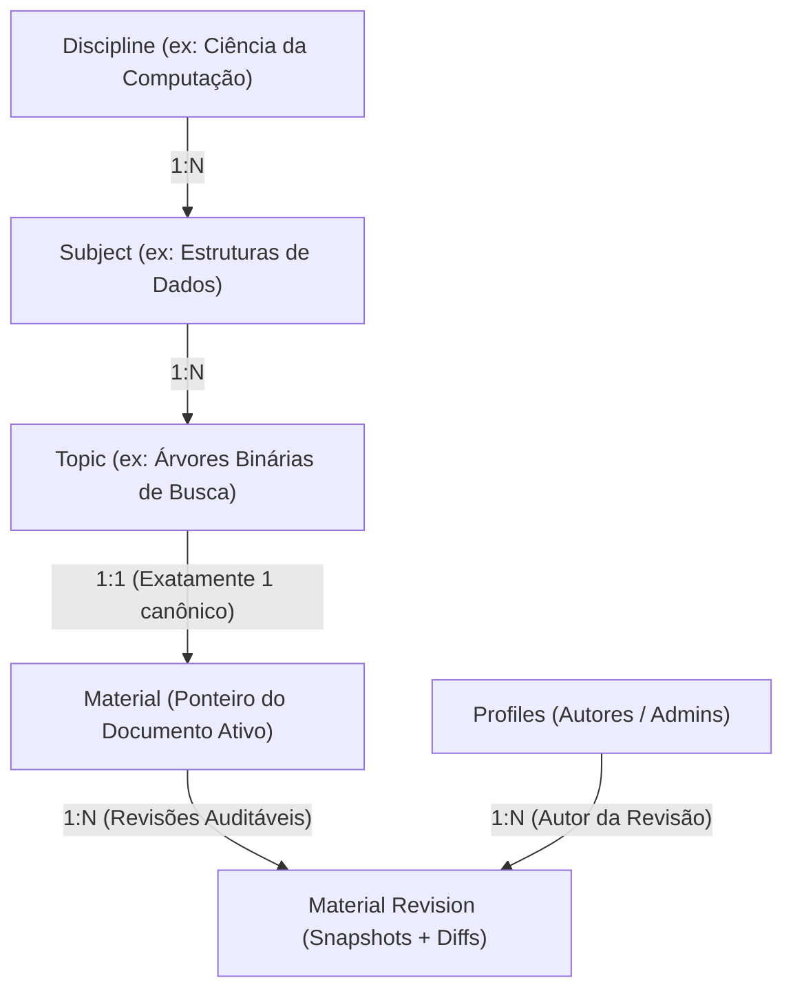
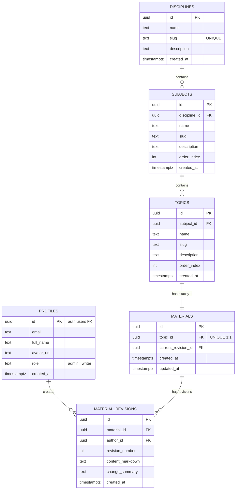

# Modelo de Dados - Zyn Library v2

Este documento descreve a modelagem relacional, arquitetura de dados e políticas de segurança da nova versão da **Zyn Library**, projetada para rodar sobre o **PostgreSQL** gerenciado pelo **Supabase**.

---

## 1. Diagramas do Modelo de Dados

### 1.1 Hierarquia Estrutural de Conhecimento



### 1.2 Diagrama Entidade-Relacionamento (ER)



---

## 2. Dicionário de Tabelas

### 2.1 `profiles`
Armazena dados públicos e papéis dos usuários cadastrados no Supabase Auth.
> **Regra de Negócio**: Visitantes comuns leem o conteúdo sem login. Apenas usuários que logarem (ex: via Google) ganham registro aqui.

| Coluna | Tipo | Restrições | Descrição |
| :--- | :--- | :--- | :--- |
| `id` | `UUID` | `PK`, `REFERENCES auth.users(id) ON DELETE CASCADE` | ID do usuário no Supabase Auth |
| `email` | `TEXT` | `NOT NULL` | Email do usuário |
| `full_name` | `TEXT` | `NOT NULL` | Nome completo |
| `avatar_url` | `TEXT` | `NULLABLE` | Foto de perfil (obtida via Google OAuth) |
| `role` | `TEXT` | `DEFAULT 'writer'`, `CHECK (role IN ('admin', 'writer'))` | Papel do usuário no sistema |
| `created_at` | `TIMESTAMPTZ` | `DEFAULT timezone('utc', now())` | Data de criação |
| `updated_at` | `TIMESTAMPTZ` | `DEFAULT timezone('utc', now())` | Última atualização |

---

### 2.2 `disciplines`
Grandes áreas de estudo.

| Coluna | Tipo | Restrições | Descrição |
| :--- | :--- | :--- | :--- |
| `id` | `UUID` | `PK`, `DEFAULT gen_random_uuid()` | Identificador único |
| `name` | `TEXT` | `NOT NULL` | Nome da disciplina (ex: "Ciência da Computação") |
| `slug` | `TEXT` | `UNIQUE NOT NULL` | Slug para URL amigável (ex: "ciencia-da-computacao") |
| `description` | `TEXT` | `NULLABLE` | Descrição informativa |
| `created_at` | `TIMESTAMPTZ` | `DEFAULT timezone('utc', now())` | Data de criação |

---

### 2.3 `subjects`
Assuntos pertencentes a uma disciplina específica.

| Coluna | Tipo | Restrições | Descrição |
| :--- | :--- | :--- | :--- |
| `id` | `UUID` | `PK`, `DEFAULT gen_random_uuid()` | Identificador único |
| `discipline_id` | `UUID` | `NOT NULL`, `REFERENCES disciplines(id) ON DELETE CASCADE` | Chave estrangeira da disciplina |
| `name` | `TEXT` | `NOT NULL` | Nome do assunto (ex: "Estruturas de Dados") |
| `slug` | `TEXT` | `NOT NULL` | Slug para URL amigável (ex: "estruturas-de-dados") |
| `description` | `TEXT` | `NULLABLE` | Descrição do assunto |
| `order_index` | `INT` | `DEFAULT 0` | Ordem de exibição |
| `created_at` | `TIMESTAMPTZ` | `DEFAULT timezone('utc', now())` | Data de criação |

*Constraint*: `UNIQUE(discipline_id, slug)` (slugs únicos dentro da mesma disciplina).

---

### 2.4 `topics`
Tópicos específicos dentro de um assunto.

| Coluna | Tipo | Restrições | Descrição |
| :--- | :--- | :--- | :--- |
| `id` | `UUID` | `PK`, `DEFAULT gen_random_uuid()` | Identificador único |
| `subject_id` | `UUID` | `NOT NULL`, `REFERENCES subjects(id) ON DELETE CASCADE` | Chave estrangeira do assunto |
| `name` | `TEXT` | `NOT NULL` | Nome do tópico (ex: "Árvores AVL") |
| `slug` | `TEXT` | `NOT NULL` | Slug para URL amigável (ex: "arvores-avl") |
| `description` | `TEXT` | `NULLABLE` | Breve introdução ou resumo do tópico |
| `order_index` | `INT` | `DEFAULT 0` | Ordem de exibição |
| `created_at` | `TIMESTAMPTZ` | `DEFAULT timezone('utc', now())` | Data de criação |

*Constraint*: `UNIQUE(subject_id, slug)` (slugs únicos dentro do mesmo assunto).

---

### 2.5 `materials`
Entidade de material único canônico por tópico (relação estrita 1:1).

| Coluna | Tipo | Restrições | Descrição |
| :--- | :--- | :--- | :--- |
| `id` | `UUID` | `PK`, `DEFAULT gen_random_uuid()` | Identificador único |
| `topic_id` | `UUID` | `UNIQUE NOT NULL`, `REFERENCES topics(id) ON DELETE CASCADE` | Chave estrangeira 1:1 com o tópico |
| `current_revision_id` | `UUID` | `NULLABLE` | Ponteiro para a revisão ativa mais recente |
| `created_at` | `TIMESTAMPTZ` | `DEFAULT timezone('utc', now())` | Data de criação |
| `updated_at` | `TIMESTAMPTZ` | `DEFAULT timezone('utc', now())` | Última modificação |

---

### 2.6 `material_revisions`
Histórico auditável de versões do material (estilo commits do Git / revisões da Wikipedia).

| Coluna | Tipo | Restrições | Descrição |
| :--- | :--- | :--- | :--- |
| `id` | `UUID` | `PK`, `DEFAULT gen_random_uuid()` | Identificador da revisão |
| `material_id` | `UUID` | `NOT NULL`, `REFERENCES materials(id) ON DELETE CASCADE` | Material associado |
| `author_id` | `UUID` | `NOT NULL`, `REFERENCES profiles(id)` | Usuário que fez a alteração |
| `revision_number` | `INT` | `NOT NULL` | Número sequencial (1, 2, 3...) |
| `content_markdown` | `TEXT` | `NOT NULL` | Snapshot completo do Markdown nesta versão |
| `change_summary` | `TEXT` | `NOT NULL` | Resumo da edição ("commit message") |
| `created_at` | `TIMESTAMPTZ` | `DEFAULT timezone('utc', now())` | Data/hora do commit |

*Constraint*: `UNIQUE(material_id, revision_number)`

---

## 3. Script SQL DDL Completo (Pronto para o Supabase)

Copie e cole este script diretamente no **SQL Editor** do seu painel do Supabase:

```sql
-- 1. EXTENSÕES
CREATE EXTENSION IF NOT EXISTS "uuid-ossp";

-- 2. TABELA PROFILES (Público, espelha auth.users)
CREATE TABLE public.profiles (
    id UUID PRIMARY KEY REFERENCES auth.users(id) ON DELETE CASCADE,
    email TEXT NOT NULL,
    full_name TEXT NOT NULL,
    avatar_url TEXT,
    role TEXT NOT NULL DEFAULT 'writer' CHECK (role IN ('admin', 'writer')),
    created_at TIMESTAMPTZ NOT NULL DEFAULT timezone('utc', now()),
    updated_at TIMESTAMPTZ NOT NULL DEFAULT timezone('utc', now())
);

-- Trigger para criar perfil automaticamente no primeiro login (Google ou Email)
CREATE OR REPLACE FUNCTION public.handle_new_user()
RETURNS TRIGGER AS $$
BEGIN
    INSERT INTO public.profiles (id, email, full_name, avatar_url, role)
    VALUES (
        NEW.id,
        COALESCE(NEW.email, ''),
        COALESCE(NEW.raw_user_meta_data->>'full_name', NEW.raw_user_meta_data->>'name', 'Usuário'),
        NEW.raw_user_meta_data->>'avatar_url',
        'writer'
    );
    RETURN NEW;
END;
$$ LANGUAGE plpgsql SECURITY DEFINER;

CREATE OR REPLACE TRIGGER on_auth_user_created
    AFTER INSERT ON auth.users
    FOR EACH ROW EXECUTE FUNCTION public.handle_new_user();

-- 3. TABELA DISCIPLINES
CREATE TABLE public.disciplines (
    id UUID PRIMARY KEY DEFAULT gen_random_uuid(),
    name TEXT NOT NULL,
    slug TEXT UNIQUE NOT NULL,
    description TEXT,
    created_at TIMESTAMPTZ NOT NULL DEFAULT timezone('utc', now())
);

-- 4. TABELA SUBJECTS
CREATE TABLE public.subjects (
    id UUID PRIMARY KEY DEFAULT gen_random_uuid(),
    discipline_id UUID NOT NULL REFERENCES public.disciplines(id) ON DELETE CASCADE,
    name TEXT NOT NULL,
    slug TEXT NOT NULL,
    description TEXT,
    order_index INT NOT NULL DEFAULT 0,
    created_at TIMESTAMPTZ NOT NULL DEFAULT timezone('utc', now()),
    CONSTRAINT unique_discipline_subject_slug UNIQUE (discipline_id, slug)
);

-- 5. TABELA TOPICS
CREATE TABLE public.topics (
    id UUID PRIMARY KEY DEFAULT gen_random_uuid(),
    subject_id UUID NOT NULL REFERENCES public.subjects(id) ON DELETE CASCADE,
    name TEXT NOT NULL,
    slug TEXT NOT NULL,
    description TEXT,
    order_index INT NOT NULL DEFAULT 0,
    created_at TIMESTAMPTZ NOT NULL DEFAULT timezone('utc', now()),
    CONSTRAINT unique_subject_topic_slug UNIQUE (subject_id, slug)
);

-- 6. TABELA MATERIALS (1:1 com topics)
CREATE TABLE public.materials (
    id UUID PRIMARY KEY DEFAULT gen_random_uuid(),
    topic_id UUID UNIQUE NOT NULL REFERENCES public.topics(id) ON DELETE CASCADE,
    current_revision_id UUID, -- Chave estrangeira adicionada após criar material_revisions
    created_at TIMESTAMPTZ NOT NULL DEFAULT timezone('utc', now()),
    updated_at TIMESTAMPTZ NOT NULL DEFAULT timezone('utc', now())
);

-- 7. TABELA MATERIAL_REVISIONS
CREATE TABLE public.material_revisions (
    id UUID PRIMARY KEY DEFAULT gen_random_uuid(),
    material_id UUID NOT NULL REFERENCES public.materials(id) ON DELETE CASCADE,
    author_id UUID NOT NULL REFERENCES public.profiles(id),
    revision_number INT NOT NULL,
    content_markdown TEXT NOT NULL,
    change_summary TEXT NOT NULL,
    created_at TIMESTAMPTZ NOT NULL DEFAULT timezone('utc', now()),
    CONSTRAINT unique_material_revision_number UNIQUE (material_id, revision_number)
);

-- Adicionar FK de current_revision_id em materials
ALTER TABLE public.materials
    ADD CONSTRAINT fk_materials_current_revision
    FOREIGN KEY (current_revision_id)
    REFERENCES public.material_revisions(id)
    ON DELETE SET NULL;

-- 8. POLÍTICAS DE SEGURANÇA (ROW LEVEL SECURITY - RLS)

-- Habilitar RLS em todas as tabelas
ALTER TABLE public.profiles ENABLE ROW LEVEL SECURITY;
ALTER TABLE public.disciplines ENABLE ROW LEVEL SECURITY;
ALTER TABLE public.subjects ENABLE ROW LEVEL SECURITY;
ALTER TABLE public.topics ENABLE ROW LEVEL SECURITY;
ALTER TABLE public.materials ENABLE ROW LEVEL SECURITY;
ALTER TABLE public.material_revisions ENABLE ROW LEVEL SECURITY;

-- REGRAS DE LEITURA: Totalmente abertas para público/visitantes anônimos (anon e authenticated)
CREATE POLICY "Leitura pública de perfis" ON public.profiles FOR SELECT USING (true);
CREATE POLICY "Leitura pública de disciplinas" ON public.disciplines FOR SELECT USING (true);
CREATE POLICY "Leitura pública de assuntos" ON public.subjects FOR SELECT USING (true);
CREATE POLICY "Leitura pública de tópicos" ON public.topics FOR SELECT USING (true);
CREATE POLICY "Leitura pública de materiais" ON public.materials FOR SELECT USING (true);
CREATE POLICY "Leitura pública de revisões" ON public.material_revisions FOR SELECT USING (true);

-- REGRAS DE ESCRITA: Exigem autenticação e verificação de perfil ativo
CREATE POLICY "Usuário pode atualizar o próprio perfil" ON public.profiles
    FOR UPDATE TO authenticated USING (auth.uid() = id);

CREATE POLICY "Escritores/Admins podem criar disciplinas" ON public.disciplines
    FOR ALL TO authenticated USING (
        EXISTS (SELECT 1 FROM public.profiles WHERE id = auth.uid() AND role IN ('admin', 'writer'))
    );

CREATE POLICY "Escritores/Admins podem gerenciar assuntos" ON public.subjects
    FOR ALL TO authenticated USING (
        EXISTS (SELECT 1 FROM public.profiles WHERE id = auth.uid() AND role IN ('admin', 'writer'))
    );

CREATE POLICY "Escritores/Admins podem gerenciar tópicos" ON public.topics
    FOR ALL TO authenticated USING (
        EXISTS (SELECT 1 FROM public.profiles WHERE id = auth.uid() AND role IN ('admin', 'writer'))
    );

CREATE POLICY "Escritores/Admins podem gerenciar materiais" ON public.materials
    FOR ALL TO authenticated USING (
        EXISTS (SELECT 1 FROM public.profiles WHERE id = auth.uid() AND role IN ('admin', 'writer'))
    );

CREATE POLICY "Escritores/Admins podem criar revisões" ON public.material_revisions
    FOR INSERT TO authenticated WITH CHECK (
        author_id = auth.uid() AND
        EXISTS (SELECT 1 FROM public.profiles WHERE id = auth.uid() AND role IN ('admin', 'writer'))
    );
```

---

## 4. Como funciona o Cálculo de Diffs

1. Cada salvamento gera um registro em `material_revisions` com o texto Markdown completo (`content_markdown`), evitando reconstruções complexas.
2. Na interface de histórico, o Next.js compara `revision_B.content_markdown` com `revision_A.content_markdown` utilizando a biblioteca `diff`:
   ```ts
   import * as Diff from 'diff'
   const changes = Diff.diffLines(oldContent, newContent)
   ```
3. O componente exibe as alterações com visualização lado a lado ou unificada, com realce verde para linhas adicionadas e vermelho para linhas removidas, além de identificar claramente o autor e a mensagem descritiva da revisão.
